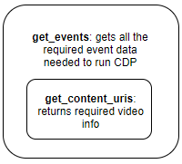

# cdp-scrapers

[](https://github.com/CouncilDataProject/cdp-scrapers/actions)
[](https://CouncilDataProject.github.io/cdp-scrapers/)

Scratchpad for scraper development and general utilities.

---

## Council Data Project

Council Data Project is an open-source project dedicated to providing journalists,
activists, researchers, and all members of each community we serve with the tools they
need to stay informed and hold their Council Members accountable.

For more information about Council Data Project, please visit
[our website](https://councildataproject.org/).

## About

`cdp-scrapers` is a collection of utilities and in-progress or actively maintained
CDP instance event scrapers. The purpose of this library is to help new CDP instance
maintainers have a quick plethora of examples for getting started on developing their
event scraper functions.

## Quick Start

### Legistar

General Legistar utility functions.

```python
from cdp_scrapers.legistar_utils import get_legistar_events_for_timespan
from cdp_scrapers.instances import get_seattle_events
from datetime import datetime

# Get all events (and minutes item and voting details)
# for a provided timespan for a legistar client
# Returns List[Dict]
seattle_legistar_events = get_legistar_events_for_timespan(
    client="seattle",
    timezone="America/Los_Angeles",
    start=datetime(2021, 7, 12),
    end=datetime(2021, 7, 14),
)

# Or parse and convert to CDP EventIngestionModel
seattle_cdp_parsed_events = get_seattle_events(
    from_dt=datetime(2021, 7, 12),
    to_dt=datetime(2021, 7, 14),
)
```

### Scrapers

#### Event Scraper Structure



Our current event scraper structure is as shown above. The main function `get_events` 
gets all the required data and it calls the `get_content_uris` function to return the 
required video data.

If your city uses Legistar and the Legistar data is publicly available.
- You may be able to reuse our scraper with minimal modifications, such as providing the 
correct Legistar client ID for your municipality.
- If the Legistar data returned only does not include the EventVideoPath field for the 
`Session.video_uri` data, you will only need to implement `get_content_uris`.

If your city does not use Legistar.
- You will need to build your own event scraper.

Example of a completed scraper: [cdp_scrapers.instances.seattle.SeattleScraper](https://councildataproject.org/cdp-scrapers/_modules/cdp_scrapers/instances/seattle.html#SeattleScraper)

For more details about creating a custom scraper for your municipality's Legistar data, 
please visit [here](https://councildataproject.org/cdp-scrapers/legistar_scraper.html).

If you would like to deploy a CDP instance or would like to use this library as a 
method for retrieving formatted legislative data, please feel free to contribute a new 
custom municipality scraper!

#### Creating a Custom Scraper

If it isn't possible to use our generalized Legistar tooling to write your scraper, 
you will need to create your own event scraper to proceed with the deployment.

1. Please see our documentation on the 
[minimum data required for CDP event ingestion](https://councildataproject.org/cdp-backend/ingestion_models.html) 
to understand what data your scraper should return.

2. From there, begin with our 
[empty custom scraper function template](https://councildataproject.org/cdp-scrapers/_modules/cdp_scrapers/instances/empty.html#get_events) 
and fill in your scraper.

3. After your scraper is completed, you can create a pull request to add your scraper 
into the [cdp-scrapers repo](https://github.com/CouncilDataProject/cdp-scrapers) 
so it can be added into the final repo for your CDP instance.

4. Our automated action will run your scraper to verify it returns the correct data. 
If it is successful, you may proceed to the next deployment step. If not, we will 
automatically share the error message so you can fix the issue and the scraper can be 
tested again afterwards.

## Installation

**Stable Release:** `pip install cdp-scrapers`<br>
**Development Head:** `pip install git+https://github.com/CouncilDataProject/cdp-scrapers.git`

## Documentation

For full package documentation please visit [councildataproject.org/cdp-scrapers](https://councildataproject.org/cdp-scrapers).

## Development

Refer to [CONTRIBUTING.md](CONTRIBUTING.md) for information related to developing the code.

**MIT license**
